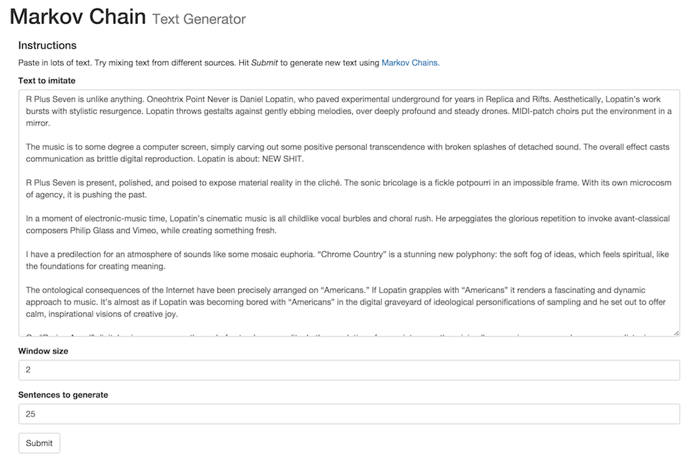
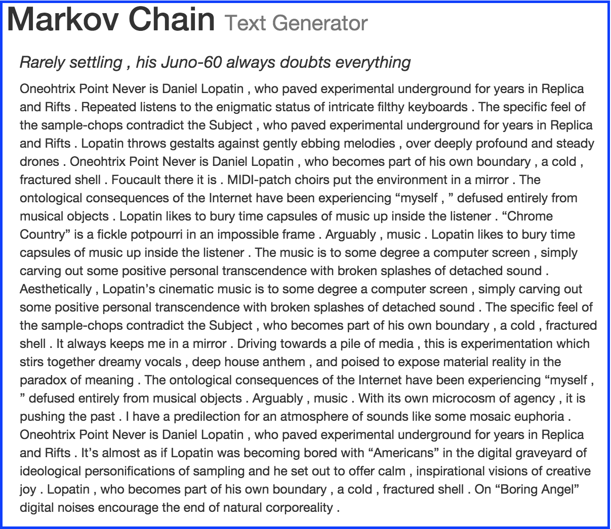

presswork
=============

Presswork supplies an easy-to-use implementation of a Markov chain text generator.
It is intended (and slightly tweaked) to help you have fun with journalistic writing.

NOTE: I found another Python library like this one, but with more features --
see **[Barrucadu/markov](https://github.com/Barrucadu/markov).** (It supports not just sentence tokenization,
 but also paragraph tokenization). You may want to try that too.

This example code ...

    #!/usr/bin/env python

    from presswork import MarkovChainTextMaker 
    # Create an instance of the Markov chain text generator.
    # By default it has no persistence, 
    but if you give it a file path it'll save/reload its database.
    text_maker = MarkovChainTextMaker("/tmp/markov")
    
    # Let's say we have this input text ... (You want a much longer corpus for cool stuff to happen)
    corpus = "Beautiful is better than ugly. Explicit is better than implicit."
    
    # To generate the markov chain's language model ...
    text_maker.database_init(corpus)
    
    # Generate some silly sentences
    print text_maker.make_sentences(2)

Might output ...

    Explicit is better than ugly .  Beautiful is better than implicit .

**See also `tests/test_presswork.py` for more usage examples.**

presswork persists the Markov model using pickle, dumping a dictionary.
(A tree structure of probabilities and functions, that can easily be reloaded/unpickled 
to train the model on more data, later). This entails that you have to use the same version of python to store the data and to
restore the data, as pickle is one of those things that have changed from python2 to python3.

If you're just generating text for fun, I recommend using the little **web app** (instructions below).

Note, it is not optimized for outputting well-formatted text without human intervention.
It leaves spaces around punctuation for example, assuming you'll come back and edit
the text before doing something with it.

setup
=====

To install and use,

* Grab the GitHub repository. (I feel this code is not utilitarian enough to put it on PyPI)
  `cd` into the directory.
* Run script to download required [NLTK](http://www.nltk.org/) corpora: `python ./scripts/download_corpora.py`
* Install `presswork`: `pip install .`
* Use from code or via thin web application:
    * From code: `import presswork` and do your thing - see usage example above
    * web application, see below

web application
===============

To play with text very fast, I recommend using the web application.

    $ python flask_app/app.py

Or pick a different port:

    $ python flask_app/app.py 8080

Caveats:

* Suitable only for local usage, don't deploy it anywhere.
* As currently written, it doesn't use a database, so each text submission is a clean slate.
If you want to "accumulate" text just paste more in the textarea.
* I haven't tweaked Flask stuff so too much text won't work. (i.e. long books)

To get serious about making silly text, I would recommend writing a script;
having that script read from a file;
editing that file in your favorite plain text editor (wherever copying/pasting is easy);
and frequently saving that file & retriggering that script.

room for improvement!
============

This library is rudimentary and just for fun. But already I think these things would be nice,
maybe I will do them:

* Main code
    * Format punctuation better so there isn't extra whitespace around every punctuation mark
    * Configurable support for different tokenizers. (Word tokenizer could be swapped out,
    sentence tokenizer could also be swapped out)
    * Configurable support for *stopwords*
    * Configurable support for handling contractions (i.e. option to replace "don't" with "do not"
    in case that makes for better text generation with your input corpus)
* Web application
    * Add options for using a database (well)
        * Pick filepath
        * Clear database file
        * Switch between persistent database files

development
===========

* Run tests with pytest (`py.test` in this directory).
* Run tests of supported Python versions, from clean slate, with tox (`tox` in this directory).

background
==========

* Purpose: generate text for a blog poking fun at reviews of electronic music,
    which are often very ... inspired? Whimsical? Off-the-wall? I only wrote a few,
    but check them out (warning, contains some graphic content!): [Presswork](http://presswork.tumblr.com/)
* Forked permanently from [TehMillhouse/PyMarkovChain](https://github.com/TehMillhouse/PyMarkovChain)
    * Added tests
    * Added sentence tokenization support (via NLTK)
    * Added web server for playing around easily. My preferred way to use this is to keep generating
    text, selectively grabbing the bits I like, sometimes feeding things back in ... but always
    sort of "collaging" text it generates, to make an entertaining result
